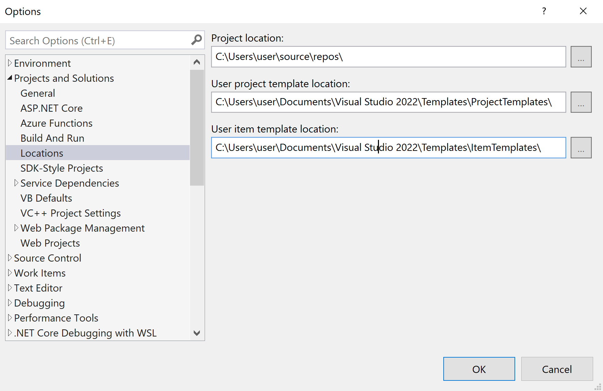

# Visual Studio Revit Add-in Templates


[](http://opensource.org/licenses/MIT)

The Visual Studio Revit add-in wizard provides a Visual Studio template for generating C# .NET Revit add-ins.

It enables the instantaneous and automatic generation, installation and debugging of a new C# Revit add-in skeleton with one single click.

Obsolete VB.NET templates are still included, but no longer updated or maintained.

Ample documentation is provided in [The Building Coder](http://thebuildingcoder.typepad.com) topic group
on [Visual Studio Revit add-in templates](http://thebuildingcoder.typepad.com/blog/about-the-author.html#5.20).


## Installation

Installation can be accomplished by cloning this repository and running the installer batch
file [install.bat](install.bat) as described in The Building Coder discussion of
the [Revit Add-In Wizards on GitHub and Installer](http://thebuildingcoder.typepad.com/blog/2015/08/revit-add-in-wizard-github-installer.html).

```
install.bat [Visual Studio Year - 2022, 2019, 2017, 2015]
```

### User Project Template Location

Ensure that the destination path specified in `install.bat` matches your user project template location.
You can change the known location for user templates in Tools &gt; Options &gt; Projects and Solutions &gt; Locations, cf.,
[how to locate and organize project and item templates](https://learn.microsoft.com/en-us/visualstudio/ide/how-to-locate-and-organize-project-and-item-templates?source=recommendations&view=vs-2022):

 <!-- 1276 -->

## Alternatives

Several alternative Revit add-in templates have been published.

They are all more complex and full-fledged than this minimalistic one, taking advantage of .NET configuration functionality, providing support for multiple Revit releases, WPF, languages, build systems, installers, Autodesk AppStore support, etc.

Here are some of them:

- [Revit2017AddInTemplateSet](https://github.com/Andrey-Bushman/Revit2017AddInTemplateSet) 
  by [Andrey Bushman](https://github.com/Andrey-Bushman);
  for a full discussion of that and comparison of the two, please refer to the article 
  on [new Visual Studio templates for Revit add-ins](http://thebuildingcoder.typepad.com/blog/2017/02/new-visual-studio-2015-templates-for-revit-add-ins.html)
- [Revit2018AddInTemplateSet](https://thebuildingcoder.typepad.com/blog/2017/09/revit-20181-nuget-packages-rooms-and-views-in-forge.html#3)
- [Multi-Version Revit Add-In Template](https://thebuildingcoder.typepad.com/blog/2018/07/vacation-and-multi-version-revit-add-in-template.html#2)
  by Yaroslav Zhmayev  
- [Revit WPF Template](https://thebuildingcoder.typepad.com/blog/2020/01/revit-wpf-add-ins-and-template.html#3)
  by Petr Mitev
- [Hellpie dotnet Revit add-in template](https://thebuildingcoder.typepad.com/blog/2020/11/bim360-management-dotnet-template-and-prism-goodies.html#4)
  by Diego Rossi
- [Multiversion Revit plugins explained](https://www.matterlab.co/post/multiversion-revit-plugins-explained) 
  by Alvaro Ortega [@alvpickmans](https://github.com/alvpickmans) Pickmans of [matterlab](https://www.matterlab.co)
  including a comprehensive [multiversion-revit-plugin-sample](https://github.com/alvpickmans/multiversion-revit-plugin-sample)
- Manual approach
  to [maintain a multi-version add-in in multiple projects in single `SLN`](https://thebuildingcoder.typepad.com/blog/2021/10/dll-as-resource-and-multi-version-add-ins.html#4.2)
  by Pablo Derendinger

## Author

Jeremy Tammik,
[The 3D Web Coder](http://the3dwebcoder.typepad.com) and
[The Building Coder](http://thebuildingcoder.typepad.com),
[ADN](http://www.autodesk.com/adn)
[Open](http://www.autodesk.com/adnopen),
[Autodesk Inc.](http://www.autodesk.com)


## License

This sample is licensed under the terms of the [MIT License](http://opensource.org/licenses/MIT).
Please see the [LICENSE](LICENSE) file for full details.
